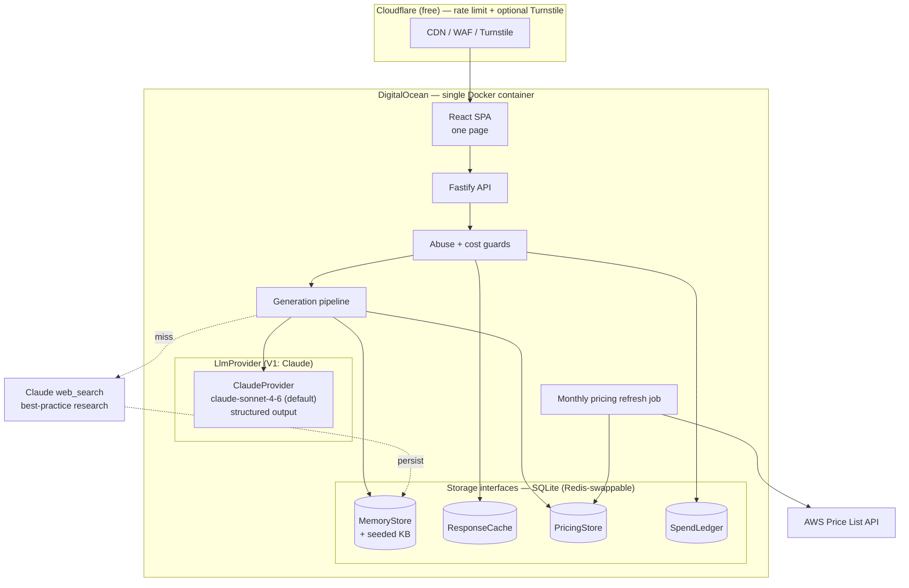
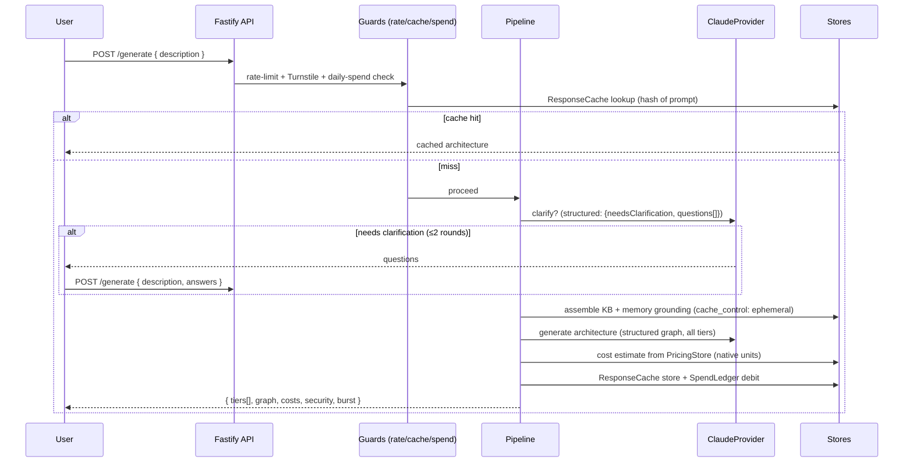

# Stackdraft

**Describe a system in plain English — get a safe, costed AWS architecture across budget / balanced / resilient tiers.**

[](https://github.com/slmatthiesen/stackdraft/actions/workflows/ci.yml)
[](./LICENSE)
[](https://nodejs.org)

**Live at [stackdraft.dev](https://stackdraft.dev).**

You type what you want to build; Stackdraft returns a recommended AWS architecture as a labeled data-flow diagram, ordered setup steps, and cost estimates in each service's **native cost unit** — presented across three robustness tiers with the trade-offs spelled out. Security and a safe-by-default posture are baked into every recommendation, not bolted on.

> Choosing the right AWS services *and* doing it securely and cost-effectively is two hard problems scattered across the Well-Architected Framework, reference architectures, the pricing calculator, and tribal knowledge. Stackdraft collapses that into one interaction: a plain-English problem in, a safe-by-default, costed, diagrammed design with explicit robustness/cost trade-offs out.

---

## How it works

1. **You describe the system.** Free-form text — "a webhook ingest API that fans out to background workers," etc.
2. **At most one or two clarifying questions**, asked only when the answer materially changes the architecture; otherwise Stackdraft proceeds.
3. **Grounded generation.** A curated knowledge base (security baselines, reference-architecture patterns, native-unit pricing facts) plus a persistent memory cache is assembled into the prompt. On a miss for an unseen topic, an optional research step fetches the current best practice and writes it back to memory (quarantined as unverified until an operator promotes it).
4. **Structured output, not prose.** The LLM (Claude, via a provider-abstracted layer) returns a validated typed graph — nodes, payload-labeled edges, per-tier services / security / scaling / cost-drivers / setup / trade-offs. The backend renders Mermaid diagrams and cost tables **deterministically** from that graph, so diagrams are reliable and costs are computable.
5. **Three tiers in one pass.** Budget / balanced / resilient are renderings of the same problem along the **robustness** axis (single-AZ vs multi-AZ, on-demand vs provisioned). All three carry the full security floor — the budget tier is the *minimum safe cost*, never a security-relaxed option.

---

## Architecture

### Component view



### Request sequence (clarify → generate → render)



---

## Features

- **Grounding** — curated KB (eight security baselines, reference-architecture patterns) + persistent memory, with optional research-on-miss that quarantines new facts as `verified:false` until an operator promotes them via CLI.
- **Structured outputs** — the model returns a validated typed graph (`output_config.format`), not free-form text; diagrams and cost tables are rendered deterministically.
- **Multi-unit cost model** — estimates in each service's **native unit**: per-1,000 operations where that unit exists (Lambda, API Gateway, DynamoDB, SQS, SNS, S3 requests), capacity-time / storage units elsewhere (EC2, RDS, Fargate, ElastiCache, ALB; $/GB-month), and **data transfer as a first-class line** — internet egress, cross-AZ, and **NAT gateway** ($/GB processed + $/hr), the most common budget surprise, surfaced explicitly because the private-subnet security default forces it.
- **Tiered output** — budget / balanced / resilient in a single generation pass, with explicit trade-offs; all tiers keep the full security floor.
- **Abuse + cost controls** — per-IP rate limiting and a per-IP daily generation cap, identical-prompt response cache, input/output token caps, and a global daily LLM-spend ceiling ($5/day default) with optional Turnstile and an optional shared-credential demo gate.
- **Eval harness + observability** — a golden prompt set asserting output *properties* (every tier covers all security baselines, all edges payload-labeled, on-demand disclaimer present, no banned services) as a tracked pass-rate, plus per-request JSON telemetry (tokens, cache-hit, research calls, latency, $ debited).

---

## Tech stack

- **Frontend:** React + Vite single-page app, Mermaid for diagrams.
- **Backend:** Node 22 + TypeScript, Fastify.
- **LLM:** Anthropic Claude (`claude-sonnet-4-6` default) behind a provider-abstracted `LlmProvider` interface; structured outputs + prompt caching.
- **Storage:** SQLite (`better-sqlite3`) behind `MemoryStore` / `ResponseCache` / `PricingStore` / `SpendLedger` interfaces — Redis-swappable.
- **Packaging:** pnpm monorepo (`apps/api`, `apps/web`, `packages/kb`), single multi-stage Docker image.

---

## Run locally

Requires **Node 22** and **pnpm 10.5.0**.

```bash
git clone https://github.com/slmatthiesen/stackdraft.git
cd stackdraft
pnpm install
cp .env.example .env          # then set ANTHROPIC_API_KEY in .env
pnpm dev
```

`pnpm dev` runs the API (which serves the SPA build / proxies the Vite dev server). The only required variable is `ANTHROPIC_API_KEY`; every other value in `.env.example` ships with a forker-safe default.

Useful scripts:

```bash
pnpm build       # pnpm -r build
pnpm test        # pnpm -r test
pnpm lint        # eslint .
pnpm typecheck   # pnpm -r typecheck
```

---

## Deploy

Stackdraft builds to a **single Docker container** (the API serves the SPA build; SQLite lives on a mounted volume). The hosted demo at [stackdraft.dev](https://stackdraft.dev) runs on DigitalOcean behind Cloudflare for edge rate-limiting and optional Turnstile. Run the monthly pricing refresh as a separate scheduled task so a large offer-file pull can't starve the request-serving process.

See [docs/deploy.md](./docs/deploy.md) for the full DigitalOcean + Cloudflare walkthrough.

---

## Cost & abuse controls

Stackdraft is a publicly hosted LLM app, so the operator pays for compute — cheap-to-run and spam-resistant are tier-1 requirements. The defaults in `.env.example` are **forker-safe**: a clone runs cheaply and abuse-protected before you tune anything.

| Lever | Env var | Default | What it bounds |
|-------|---------|---------|----------------|
| Global daily spend ceiling | `DAILY_SPEND_CEILING_USD` | `5` | Hard backstop — new generations refused (cache-only) once hit. Reserve-on-entry + transactional, so concurrent requests can't overshoot. |
| Per-IP daily generation cap | `PER_IP_DAILY_GENERATIONS` | `20` | One actor can't drain the shared budget. |
| Per-IP rate limit | `RATE_LIMIT_MAX` / `RATE_LIMIT_WINDOW_MS` | `30` / `60000` | Burst protection (keyed by `CF-Connecting-IP` when present). |
| Identical-prompt response cache | `RESPONSE_CACHE_TTL_MS` | `86400000` (24h) | Repeat prompts served from cache — no LLM call, no spend, no cap charge. |
| Output token cap | `LLM_MAX_TOKENS` | `8000` | Bounds per-call output cost. |
| Input token cap | `LLM_MAX_INPUT_TOKENS` | `12000` | `count_tokens` pre-check rejects oversized prompts. |
| Optional bot check | `TURNSTILE_SECRET` / `TURNSTILE_SITE_KEY` | unset (off) | Cloudflare Turnstile friction. |
| Optional demo access gate | `ACCESS_GATE_USER` / `ACCESS_GATE_PASS` | unset (off) | HTTP basic auth on the hosted demo; off so local/forked instances run open. |

The access gate and CAPTCHA are *friction*; the per-IP cap, token caps, and global ceiling are what actually bound the worst-case bill.

---

## Design notes

**Grounding + structured generation.** Recommendations are grounded in a curated KB and a persistent memory store, then generated as a validated typed graph rather than prose — making diagrams reliable, costs computable, and outputs testable. The **prompt-cache breakpoint is strictly static**: only the system prompt + the full security-baselines block sit in the cached prefix (~90% input-cost cut on repeated grounding via `cache_control: ephemeral`). Per-request matched reference patterns and memory hits are volatile and go in the suffix *after* the breakpoint — putting them in the prefix would change the cache key every request and waste the write premium.

---

## Project status

**V1 (current)** ships the core loop: describe → (clarify) → grounded structured generation → tiered diagrams + native-unit costs + security-by-default, with abuse/cost controls, an eval harness, and a single-container deploy.

**V2 roadmap** — a **stack-review mode** (paste an existing architecture, get a security/cost/robustness review), multi-provider side-by-side comparison (add a `GeminiProvider`), a per-knob dev/non-prod lens, additional pricing regions, and a user feedback loop.

---

## License

[MIT](./LICENSE) © 2026 Steven Matthiesen.

## Security

Found a vulnerability? Please report it privately — see [SECURITY.md](./SECURITY.md). Stackdraft models the safe-by-default posture it recommends: no secrets in the tree or history, secrets loaded from env and redacted in logs, conservative defaults.

## Contributing

Contributions welcome — see [CONTRIBUTING.md](./CONTRIBUTING.md) for setup, test/lint/typecheck, branch naming, Conventional Commits, and the PR process. By participating you agree to the [Code of Conduct](./CODE_OF_CONDUCT.md).
