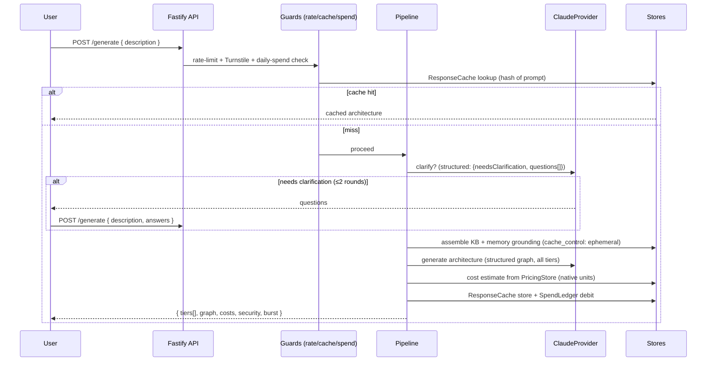

# feat: Drafture

A publicly hosted, one-page web tool. A user describes the system they want to build in a text box; the tool returns a recommended AWS architecture as a labeled data-flow diagram, plain-language setup instructions, and cost estimates in each service's **native cost unit** (per-1,000 operations where applicable, plus capacity-time / storage / data-transfer units), presented across robustness tiers with the trade-offs spelled out. Security and a safe-by-default posture are baked into every recommendation. The operator self-hosts on DigitalOcean and pays the compute, so **cheap-to-run and spam-resistant are tier-1 requirements**.

---

## Summary

The user types a description → the prompt slides up to become the page header/goal → the recommended architecture renders below it. The tool asks **at most one or two rounds of clarification** before generating, then produces, for each robustness tier (budget / balanced / resilient): a Mermaid data-flow diagram whose arrows describe the payload moving between services, setup instructions, cost estimates in each service's native unit, burst-handling notes, security notes, and the trade-offs of that tier versus the others.

Recommendations are **grounded**: a seeded curated knowledge base of AWS best-practice / security / pricing facts plus a persistent memory cache. On a miss for something new, an agent searches for the current best practice and writes it back to memory so the next request is grounded (the iterative part of the design). Generation runs through a **provider-abstracted LLM layer** (V1: Claude only) using **structured outputs**, so the architecture comes back as a typed graph the backend renders deterministically — not free-form text.

This plan covers V1. **Out of scope for V1:** payment/billing (tiers are *output variants*, not a checkout), multi-provider side-by-side comparison, and a user feedback loop — all deferred to V2.

---

## Problem Frame

People who want to ship on AWS face two hard problems: (1) choosing the right services for their workload, and (2) doing it *securely* and *cost-effectively* without deep AWS expertise. Existing answers are scattered across the Well-Architected Framework, reference architectures, the pricing calculator, and tribal knowledge. There is no single tool that takes a plain-English problem and returns a safe-by-default, costed, diagrammed design with explicit robustness/cost trade-offs.

This tool collapses that into one interaction. It is also an **open-source showcase project** the operator intends to publish and share — demonstrating AI-engineering rigor (grounding, structured generation, cost control, abuse control on a publicly hosted LLM app). Because the repo will be public, **secret hygiene and a pre-publish safety audit are first-class requirements**, and the codebase should itself model the safe-by-default practices the tool recommends. The first git commit is deliberately deferred until that audit passes — nothing is committed before the repo is verified clean.

**Primary actor:** an engineer or founder describing a system to build.
**Core outcome:** a recommended AWS architecture they can act on, with security handled by default and costs framed as per-unit ranges (per-1,000 where applicable) across tiers.

---

## Requirements

| ID | Requirement |
|----|-------------|
| R1 | Accept a free-form natural-language description of the desired system. |
| R2 | Ask **at most one or two** rounds of clarifying questions, only when the answer materially changes the architecture; otherwise proceed. |
| R3 | Produce a recommended AWS architecture for each of three robustness tiers (budget / balanced / resilient), with explicit trade-offs between them. |
| R4 | Render a data-flow diagram (Mermaid) where each edge is labeled with the payload/data passing between services. |
| R5 | Provide plain-language, ordered setup instructions per tier. |
| R6 | Provide cost estimates as **ranges, per tier**, using each service's **native cost unit**: per-1,000 operations where that unit exists (Lambda, API Gateway, DynamoDB, SQS, SNS, S3 requests) and capacity-time / storage / **data-transfer** units where it does not (EC2, RDS, Fargate, ElastiCache, ALB; storage; internet egress, cross-AZ, **NAT gateway**). Always disclaimed as on-demand list prices for a **single default region (us-east-1 in V1)**; the pricing store is region-keyed so additional regions are a later toggle. |
| R7 | Bake security and a safe-by-default posture into every recommendation (encryption in transit/at rest, least-privilege IAM, no public data stores, secrets management, network isolation, edge protection) — non-negotiable, surfaced in the output. |
| R8 | Handle burst traffic / reads / writes: build the mechanism into the core when it is a trivial add; otherwise call it out explicitly in the output as an option. |
| R9 | Ground recommendations in a seeded curated KB + persistent memory; on a miss, research the best practice and persist it for reuse. |
| R10 | Refresh AWS pricing data on a ~monthly cadence and cache it; never block a request on a live pricing call. |
| R11 | **Tier-1: abuse + cost controls** — per-IP rate limiting **and a per-IP daily generation cap**, identical-prompt response caching, input/output-token caps, a **global daily LLM-spend ceiling (default $5/day)**, an optional lightweight bot check, and an optional shared-credential access gate for the hosted demo. |
| R12 | Run cheaply on the operator's existing DigitalOcean hosting; deployable as a single container. |
| R13 | LLM access is provider-abstracted (V1 Claude) so providers can be swapped or compared later without rearchitecting. |
| R14 | **Open-source-ready & showcase-quality** — an OSI license, a polished README (what it is, architecture, run-locally, deploy, demo), and contributor/community docs (CONTRIBUTING, SECURITY, CODE_OF_CONDUCT, issue/PR templates), with CI (lint + typecheck + test) and automated dependency/secret scanning. |
| R15 | **Safe to publish** — no secrets, keys, `.env` contents, or private data in the working tree *or git history*; only `.env.example` is tracked; logs/errors redact secrets; config defaults are forker-safe (conservative spend ceiling, rate limits, and bot check on by default) so a clone can't accidentally run up a bill. A pre-publish audit must pass before the first commit/push. |
| R16 | **Eval harness + observability** — a golden prompt set with asserted output properties (every tier covers the eight security baselines; all edges payload-labeled; on-demand disclaimer present; no banned services), run as a tracked pass-rate on model/KB changes; plus structured per-request telemetry (input/output/cache tokens, cache-hit, research-call count, latency, $ debited) emitted as JSON log lines. |

---

## Key Technical Decisions

**KTD1 — TypeScript end-to-end (default).** React (Vite) single-page frontend + Node/TypeScript backend (Fastify). Matches the operator's primary stack, gives one language across the data-flow, and the Anthropic TS SDK is first-class. *(Confirmed: TypeScript, per Open Question 1. The provider/storage interfaces stay abstracted, so a Python port remains possible later without rearchitecting.)*

**KTD2 — Provider-abstracted LLM layer; V1 = Claude.** Define an `LlmProvider` interface; ship a `ClaudeProvider` (Anthropic SDK). **Launch default model is `claude-sonnet-4-6`** — Opus 4.8 is a premium tier and, for a free public tool with a daily spend ceiling, risks exhausting the ceiling after a handful of generations (large grounded outputs + cache write-premium + premium output pricing); Sonnet gives far more generations per dollar at strong quality. Model id and `effort` are config, so Opus is an opt-in quality toggle (one-line change) once real-traffic cost is observed against the ceiling. V2 adds a `GeminiProvider` and the side-by-side compare view. *(Per global preference for provider-abstracted architecture; resolves Open Question 3.)*

**KTD3 — Structured outputs, not prose.** The LLM returns a validated JSON object (typed graph: nodes, payload-labeled edges, per-tier services/security/scaling/cost-drivers/setup/trade-offs) via `output_config.format` (`messages.parse()`). The backend renders Mermaid and cost tables deterministically from that graph. This makes the diagram reliable, the costs computable, and the output testable — far better than asking the model for raw Mermaid + prose. *(Grounded in claude-api skill: structured outputs supported on Opus 4.8 / Sonnet 4.6.)*

**KTD4 — Grounding via curated KB + memory, with research-on-miss.** A seeded KB (security baselines, reference-architecture patterns, pricing facts) is assembled into the generation prompt. A persistent **memory store** caches best-practices the agent discovers. On a miss for a needed topic, a research step uses Claude's server-side `web_search` tool to find the current best practice and writes it back to memory **into a `verified:false` quarantine** — it is used (so it helps current and future requests) but flagged "unverified" in the output and excluded from the trusted KB until the operator flips it via a small **CLI review path** (U6: `list-pending-facts` / `verify-fact <id>`), so a single sloppy research result cannot permanently poison recommendations for all users. *(This is the part the user flagged for iteration; built behind a flag so it can be tuned or disabled without touching generation.)*

**KTD5 — Storage behind interfaces; SQLite now, Redis-swappable.** `MemoryStore`, `ResponseCache`, `PricingStore`, and `SpendLedger` are interfaces. V1 implementation is SQLite (`better-sqlite3`) — a single file, zero extra services, cheap on a DigitalOcean droplet. A Redis implementation can be dropped in later behind the same interfaces (the user's "Redis memory" idea) without changing callers.

**KTD6 — Pricing: monthly-refreshed cache from the public Bulk offer files, multi-unit normalization (incl. data transfer), offline fallback.** A scheduled job pulls AWS unit prices from the **Price List Bulk API offer-index JSON files** (`pricing.us-east-1.amazonaws.com/offers/...` — public HTTPS GET, **no AWS credentials**, full per-service snapshots), normalizes them into the **service's native cost unit** (not forced to per-1,000) for ~12–15 common services **in a single default region (us-east-1 in V1)**, and stores them in `PricingStore` **keyed by `(service, region)`** so additional regions are a later toggle. Requests read the cache only. A seeded pricing-facts file is the offline fallback if a refresh fails. Estimates are always presented as **ranges**, disclaimed as **on-demand list prices** (excludes Free Tier / Savings Plans / Reserved / negotiated discounts). Per-service units are non-uniform and the model carries the unit rather than assuming per-1,000: **request-priced** services (Lambda `$/request + $/GB-s`; API Gateway / CloudFront / SQS / SNS per-million → ÷1000; DynamoDB on-demand per-million RRU/WRU; S3 per-1,000 request tiers) present per-1,000; **capacity/time-priced** (EC2, RDS, Fargate, ElastiCache, ALB) and **per-MAU** (Cognito) have no native per-1,000 unit and use an explicit assumed-throughput estimate flagged to the user; **storage** is $/GB-month; and **data transfer is a first-class unit** — internet egress (~$0.09/GB), cross-AZ ($0.01/GB each way), and **NAT gateway ($0.045/GB processed + $/hour)**, which is the most common budget surprise and is *forced* by the private-subnet security default (R7 baseline #5). The estimator therefore surfaces the security default's recurring cost explicitly rather than hiding it. *(R6, R10.)*

**KTD7 — Cost control is layered and enforced.** `max_tokens` hard ceiling per call; `output_config.effort` to bound spend; `count_tokens` pre-check; **prompt-cache the KB grounding prefix** (`cache_control: ephemeral`, ~90% input-cost cut on repeated grounding); **identical-prompt response cache** (hash of normalized prompt+params → stored result, TTL) to avoid repeat LLM calls entirely; and a **global daily LLM-spend ledger** that refuses new generations once a configured ceiling is hit (**default $5/day**). The ceiling check is **reserve-on-entry and transactional** — a provisional debit is written inside a SQLite transaction at guard time and reconciled to actual usage after generation, so concurrent requests cannot each pass the check and overshoot the ceiling. *(R11, grounded in claude-api skill: prompt caching + token-cap controls.)*

**KTD8 — Abuse controls in app + at the edge, with a per-IP daily cap and an optional demo gate.** Per-IP rate limiting, a **per-IP daily generation cap** (`PER_IP_DAILY_GENERATIONS`, default low — so one heavy user or attacker can't drain the shared budget), and the global daily-spend ceiling all live in the app (always enforced, even direct-to-origin). Cloudflare (free tier) sits in front of the DigitalOcean origin for additional rate-limiting and an optional **Turnstile** bot check. For the hosted demo, an **optional shared-credential access gate** (HTTP basic auth via `ACCESS_GATE_USER`/`ACCESS_GATE_PASS`) adds light friction against drive-by bots while keeping the repo/code fully public; it is **off by default** so local and forked instances run open. The per-IP cap protects availability for everyone (one actor can't spend the day's budget); the global ceiling is the hard backstop (when hit, the tool serves cache-only for the rest of the day). *(R11, R12.)*

**KTD9 — Tiers are output variants along the robustness axis.** Budget / balanced / resilient are three renderings of the same problem, produced in one generation pass, not separate products or paywalls. The axis they vary is **robustness (availability + scalability)** — single-AZ vs multi-AZ, on-demand vs provisioned — with cost as the *consequence* of those choices, not an independent knob. **All three tiers keep the full R7 security floor** — the budget tier is the *minimum safe cost*, never a security-relaxed option, and the output frames it that way; finer per-knob toggles (e.g. a dev/non-prod lens that relaxes availability but never security) are deferred to V2. No billing in V1. *(R3.)*

**KTD10 — Open-source posture: permissive license + forker-safe defaults + secret hygiene by construction.** License: **MIT** (most recognizable/permissive for a showcase — confirmed, Open Question 4). The repo never tracks secrets: `.gitignore` excludes `.env`, `*.db`, and build artifacts from the start; only `.env.example` (placeholder values) is committed; secrets load from env at runtime and are redacted in logs/errors. Config **defaults are conservative** so anyone who clones and runs it is protected before they tune anything — low daily-spend ceiling, rate limits on, bot check on. A pre-publish secret/security audit (U14) gates the very first commit. *(R14, R15; mirrors the safe-by-default posture the tool itself recommends.)*

**KTD11 — The prompt-cache breakpoint is strictly static.** Prompt caching only hits on an exact prefix match and charges a write premium (1.25× for 5-min, 2× for 1-h), so the cacheable prefix must contain **only** truly static content: the system prompt + the *full* security-baselines block. Per-request matched reference-architecture patterns and memory hits are **volatile** — they go in the suffix *after* the breakpoint, because they vary per request; putting them in the prefix changes the cache key every request (cache never hits, write premium wasted). The grounding assembler (U5) places the breakpoint at exactly this boundary; U2 asserts it. *(R9, R11.)*

---

## High-Level Technical Design

### Component view

```mermaid
flowchart TB
  subgraph Edge["Cloudflare (free) — rate limit + optional Turnstile"]
    CF[CDN / WAF / Turnstile]
  end
  subgraph DO["DigitalOcean — single Docker container"]
    UI[React SPA<br/>one page]
    API[Fastify API]
    PIPE[Generation pipeline]
    GUARD[Abuse + cost guards]
    subgraph LLM["LlmProvider (V1: Claude)"]
      CLAUDE[ClaudeProvider<br/>claude-sonnet-4-6 (default)<br/>structured output]
    end
    subgraph STORE["Storage interfaces — SQLite (Redis-swappable)"]
      MEM[(MemoryStore<br/>+ seeded KB)]
      RC[(ResponseCache)]
      PRICE[(PricingStore)]
      LEDGER[(SpendLedger)]
    end
    JOB[Monthly pricing refresh job]
  end
  WEB[Claude web_search<br/>best-practice research]
  AWSP[AWS Price List API]

  CF --> UI --> API --> GUARD --> PIPE
  PIPE --> CLAUDE
  PIPE --> MEM
  PIPE -. miss .-> WEB -. persist .-> MEM
  GUARD --> RC
  GUARD --> LEDGER
  PIPE --> PRICE
  JOB --> AWSP
  JOB --> PRICE
```

### Request sequence (clarify → generate → render)



### Generation output shape (directional — not implementation spec)

```jsonc
// LLM structured output, validated by output_config.format
{
  "assumptions": ["..."],
  "clarificationsUsed": ["..."],
  "tiers": [
    {
      "name": "budget | balanced | resilient",
      "summary": "...",
      "nodes": [{ "id": "api", "awsService": "API Gateway", "purpose": "...",
                  "security": ["TLS", "WAF", "least-priv role"],
                  "scaling": { "burst": "throttling + caching", "trivialInCore": true } }],
      "edges": [{ "from": "client", "to": "api", "payload": "JSON request body", "protocol": "HTTPS" }],
      "setupSteps": ["..."],
      "costDrivers": [
        { "service": "Lambda", "unit": "per 1k requests", "estimateRange": "$0.x–$0.y" },
        { "service": "NAT Gateway", "unit": "$0.045/GB processed + $0.045/hr", "estimateRange": "$x–$y/mo", "note": "required by private-subnet default" }
      ],
      "burstHandling": ["built-in: ...", "optional: ..."],
      "securityNotes": ["..."],
      "tradeoffs": ["vs balanced: ...", "vs resilient: ..."]
    }
  ]
}
```

---

## Output Structure

```
drafture/
├─ LICENSE                      # MIT
├─ README.md                    # showcase: what/why, architecture, run-local, deploy, demo
├─ CONTRIBUTING.md
├─ SECURITY.md                  # how to report a vuln; supported scope
├─ CODE_OF_CONDUCT.md
├─ .gitignore                   # excludes .env, *.db, dist/, node_modules
├─ .env.example                 # placeholders only — the ONLY tracked env file
├─ .github/
│  ├─ workflows/ci.yml          # lint + typecheck + test + build
│  ├─ workflows/secret-scan.yml # gitleaks/trufflehog on push + PR
│  ├─ dependabot.yml
│  └─ ISSUE_TEMPLATE/ , PULL_REQUEST_TEMPLATE.md
├─ .gitleaks.toml               # secret-scan config (also a pre-commit hook)
├─ package.json                 # workspace root (pnpm)
├─ Dockerfile
├─ docker-compose.yml           # local: app (+ optional redis later)
├─ apps/
│  ├─ web/                      # React + Vite SPA (one page)
│  │  ├─ src/
│  │  │  ├─ App.tsx             # text box → header animation → results
│  │  │  ├─ components/         # DiagramView, TierTabs, CostTable, SecurityPanel, ClarifyForm
│  │  │  └─ lib/mermaid.ts      # structured graph → mermaid string
│  │  └─ index.html
│  └─ api/                      # Fastify backend
│     ├─ src/
│     │  ├─ server.ts
│     │  ├─ routes/{generate.ts,clarify.ts,health.ts}
│     │  ├─ pipeline/{clarify.ts,ground.ts,generate.ts,cost.ts}
│     │  ├─ llm/{provider.ts,claude.ts}            # LlmProvider + ClaudeProvider
│     │  ├─ research/bestPractice.ts               # web_search → memory
│     │  ├─ store/{memory.ts,responseCache.ts,pricing.ts,spendLedger.ts,sqlite.ts}
│     │  ├─ guards/{rateLimit.ts,turnstile.ts,spend.ts}
│     │  └─ schema/architecture.ts                 # JSON schema + TS types
│     └─ jobs/refreshPricing.ts                    # monthly cron
├─ packages/
│  └─ kb/                       # seeded curated knowledge base
│     ├─ security-baselines.json
│     ├─ reference-architectures.json
│     └─ pricing-facts.seed.json
```

*Scope declaration, not a constraint — the implementer may adjust layout. Per-unit `Files` lists are authoritative.*

---

## Implementation Units

### U1. Project scaffold, config, and Docker shell

**Goal:** Stand up the pnpm workspace (web + api), shared TS config, env handling, and a single-container Dockerfile that serves the SPA from the API.
**Requirements:** R12.
**Dependencies:** none.
**Files:** `package.json`, `pnpm-workspace.yaml`, `tsconfig.base.json`, `apps/web/*` (Vite scaffold), `apps/api/src/server.ts`, `apps/api/src/routes/health.ts`, `Dockerfile`, `docker-compose.yml`, `.env.example`.
**Approach:** Fastify serves static SPA build + `/api/*`. Config via `env` (`ANTHROPIC_API_KEY`, `LLM_MODEL` [default `claude-sonnet-4-6`], `LLM_EFFORT`, `DEFAULT_REGION` [default `us-east-1`], `DAILY_SPEND_CEILING_USD` [default `5`], `PER_IP_DAILY_GENERATIONS` [default low], `RATE_LIMIT_*`, `TURNSTILE_*`, `ACCESS_GATE_USER`/`ACCESS_GATE_PASS` [optional; gate off when unset], `PRICING_REFRESH_CRON`, `DB_PATH`). Multi-stage Docker build → one image.
**Patterns to follow:** standard Vite + Fastify static-serve; 12-factor env config.
**Test scenarios:**
- `/api/health` returns 200 with build/version. (happy path)
- Server boots with all required env vars; missing `ANTHROPIC_API_KEY` fails fast with a clear error. (error path)
- `Test expectation: none` for the Dockerfile itself beyond a CI build-smoke that the image starts and `/api/health` responds.
**Verification:** `docker run` the image; SPA loads and `/api/health` responds.

### U2. LLM provider abstraction + ClaudeProvider

**Goal:** A swappable `LlmProvider` interface with a Claude implementation supporting structured output, token accounting, prompt caching, and token caps.
**Requirements:** R13, R3, R7, R11.
**Dependencies:** U1.
**Files:** `apps/api/src/llm/provider.ts`, `apps/api/src/llm/claude.ts`, `apps/api/src/schema/architecture.ts`.
**Approach:** Interface methods: `clarify(input) → {needsClarification, questions[]}`, `generate(groundedPrompt, schema) → ArchitectureResult`, `countTokens(...)`, returning `{result, usage}`. `ClaudeProvider` uses the Anthropic TS SDK, `model = claude-sonnet-4-6` (default; Opus 4.8 opt-in via config), `output_config.format` with the architecture JSON schema, `max_tokens` ceiling, `output_config.effort`, and `cache_control: { type: "ephemeral" }` on the **static** grounding prefix only (KTD11). Stream when `max_tokens` is large. Surfaces `usage` (input/output/cache tokens) for the spend ledger.
**Patterns to follow:** claude-api skill — `messages.parse()` / `output_config.format`; prompt-caching prefix rules (stable content first, volatile last); typed-exception error chain (`RateLimitError` → `APIStatusError` → `APIConnectionError`).
**Technical design:** schema mirrors the "Generation output shape" above; `additionalProperties: false`, all fields required per the structured-output constraints.
**Test scenarios:**
- `generate` returns a schema-valid `ArchitectureResult` for a representative prompt (mock SDK). (happy path)
- Schema validation rejects a malformed model response and triggers one retry. (error path)
- `clarify` returns `needsClarification:false` for a fully-specified prompt and `true` with ≤2 questions for an ambiguous one. (edge — Covers R2)
- `usage` is propagated so the caller can debit the ledger. (integration)
- Prompt-cache breakpoint placed **only** on the static prefix (system prompt + full security baselines); matched reference patterns and memory hits are in the volatile suffix (assert request shape — KTD11). (edge)
- `RateLimitError` and `APIConnectionError` are surfaced as typed, retryable failures. (error path)
**Verification:** unit tests pass against a mocked SDK; a single live smoke call returns a valid structured result.

### U3. Storage interfaces — MemoryStore, ResponseCache, PricingStore, SpendLedger (SQLite)

**Goal:** Persistence behind interfaces, SQLite-backed, Redis-swappable.
**Requirements:** R9, R10, R11, R12.
**Dependencies:** U1.
**Files:** `apps/api/src/store/{memory.ts,responseCache.ts,pricing.ts,spendLedger.ts,sqlite.ts}`.
**Approach:** Define each interface and a `better-sqlite3` implementation. `MemoryStore`: upsert/get best-practice docs keyed by topic, with provenance + timestamp. `ResponseCache`: get/set by prompt-hash with TTL. `PricingStore`: get unit prices by `(service, region)`; replace-by-month. `SpendLedger`: reserve-on-entry (provisional debit in a transaction at guard time, reconciled post-generation), sum today's USD, check the global ceiling (KTD7), **and record per-IP generation counts for the per-IP daily cap (U8)**. One DB file; migrations on boot.
**Patterns to follow:** repository pattern; deterministic JSON serialization for hash keys (sorted keys) — see prompt-caching silent-invalidator guidance.
**Test scenarios:**
- MemoryStore upsert then get returns the stored doc; second upsert overwrites. (happy path)
- ResponseCache returns undefined after TTL expiry. (edge)
- ResponseCache key is stable across logically-identical prompts (whitespace/key-order normalized). (edge — Covers R11)
- SpendLedger sums only today's rows across a day boundary. (edge)
- SpendLedger reserve-on-entry is transactional: N concurrent requests cannot each pass the ceiling check (no overshoot). (edge — Covers R11)
- SpendLedger counts per-IP generations per day for the per-IP cap (U8); the count resets across a day boundary. (edge — Covers R11)
- PricingStore reads/writes are keyed by `(service, region)`; monthly replace removes the prior month's rows atomically. (integration — Covers R6/R10)
**Verification:** unit tests against a temp SQLite file pass.

### U4. Seeded curated knowledge base + pricing-facts schema

**Goal:** Ship the seed KB the system grounds on, and the pricing-facts schema/seed used as the offline cost fallback.
**Requirements:** R7, R9, R10.
**Dependencies:** U3.
**Files:** `packages/kb/security-baselines.json`, `packages/kb/reference-architectures.json`, `packages/kb/pricing-facts.seed.json`, `apps/api/src/store/memory.ts` (KB loader).
**Approach:** `security-baselines.json` — the safe-by-default rules applied to every design, each with a one-line rationale + citation. Seed the eight highest-value rules: (1) encrypt at rest (KMS/SSE), (2) encrypt in transit (TLS-only; `aws:SecureTransport`), (3) least-privilege IAM (scoped roles, no long-lived keys, no wildcards), (4) S3 account-level Block Public Access, (5) no public data tier (RDS/ElastiCache in private subnets), (6) secrets in Secrets Manager/SSM, (7) edge protection (CloudFront + WAF managed + rate-based rules; Shield Standard automatic), (8) CloudTrail + access logging on. `reference-architectures.json` — canonical patterns (serverless API, container API, queue-based async, static-site + API) with services, burst mechanisms, and when-to-use. `pricing-facts.seed.json` — native-unit costs (per-1,000 where applicable, plus capacity-time / storage / data-transfer incl. NAT/egress) for ~12–15 common services in the default region, as the offline fallback. Loader seeds these into MemoryStore/PricingStore on first boot. Seed content drawn from the AWS Well-Architected Security pillar, AWS Security Reference Architecture, AWS Architecture Center / Reference Architecture Diagrams library, and AWS Prescriptive Guidance (Sources). *(Operator offered to help source/curate this.)*
**Patterns to follow:** keep entries citeable (source URL per fact) so research-on-miss appends in the same shape.
**Test scenarios:**
- Loader seeds all baselines/patterns/pricing facts idempotently (re-run does not duplicate). (happy path)
- Every security baseline has a rationale + source field. (edge — Covers R7)
- Pricing seed covers each service referenced by the seed reference-architectures. (integration)
**Verification:** boot seeds the stores; a content-completeness test passes.

### U5. Grounding + clarification + generation pipeline (core)

**Goal:** The heart: decide on clarification, assemble grounded context, generate the tiered architecture with security and burst handling baked in.
**Requirements:** R1, R2, R3, R4, R5, R7, R8.
**Dependencies:** U2, U3, U4.
**Files:** `apps/api/src/pipeline/{clarify.ts,ground.ts,generate.ts}`.
**Approach:** `clarify` runs the structured clarify call; the route enforces the ≤2-round cap (round count carried in the request). `ground` assembles the prompt in two segments split by the cache breakpoint (KTD11): the **static cacheable prefix** = system prompt (safe-by-default mandate) + the *full* security-baselines block; the **volatile suffix** (after the breakpoint) = matched reference-architecture patterns + memory hits for the detected domain + the user description + answers. (Matched patterns and memory are volatile — varying per request — so they must not be in the cacheable prefix.) `generate` calls `LlmProvider.generate` with the architecture schema and returns all three tiers in one pass. Burst handling: the system prompt instructs "build burst mechanisms into the core when trivial (mark `trivialInCore:true`), otherwise list as an option in `burstHandling`" — trivial-by-default set = DynamoDB on-demand, API Gateway throttling, CloudFront caching, Lambda reserved concurrency; options = provisioned concurrency, provisioned+auto-scaling, SQS buffering. Default new datastores to DynamoDB on-demand unless the user signals steady high volume (auto-scaling won't absorb short spikes). When a generated tier uses the private-subnet default (R7 #5), the security/burst notes call out the recurring NAT-gateway + egress cost that default incurs (priced by U7), so the secure choice isn't presented as free. The system prompt also frames the **budget tier as the minimum *safe* cost** — all three tiers carry the full security floor (R7), so budget never means security-relaxed; the output states this explicitly so users don't read "budget" as "cheap-because-insecure."
**Execution note:** implement the grounding assembly test-first — the cache-prefix ordering and "security baselines always present" invariants are the load-bearing behaviors.
**Patterns to follow:** prompt-caching placement — breakpoint after the static prefix only (KTD11); claude-api structured-output usage.
**Test scenarios:**
- Fully-specified prompt skips clarification and generates three tiers. (happy path — Covers R3)
- Ambiguous prompt yields ≤2 clarification questions, then generates on the second round regardless. (edge — Covers R2)
- Every generated tier includes non-empty `securityNotes` and applies the baseline rules. (edge — Covers R7)
- A high-throughput description yields burst mechanisms either in-core (`trivialInCore:true`) or in `burstHandling`. (edge — Covers R8)
- Edges carry payload labels for every connection. (edge — Covers R4)
- Grounding includes memory hits when present for the domain. (integration — Covers R9)
**Verification:** pipeline tests (mocked provider) pass; a live smoke run on 3 sample prompts returns sane, secure tiers.

### U6. Best-practice research-on-miss → memory

**Goal:** When grounding lacks a needed best-practice, research it via Claude `web_search` and persist it for reuse. (The iterative piece.)
**Requirements:** R9.
**Dependencies:** U2, U3, U5.
**Files:** `apps/api/src/research/bestPractice.ts`, `apps/api/scripts/{listPendingFacts.ts,verifyFact.ts}` (operator review CLI).
**Approach:** During `ground`, detect topics with no KB/memory hit. Behind a `RESEARCH_ON_MISS` flag, call the provider with the `web_search` server tool to fetch a current best practice, normalize to the KB doc shape (fact + rationale + source URL, `verified:false`), and `MemoryStore.upsert` it into quarantine (KTD4) — used but flagged "unverified" in the output until operator review. The operator promotes facts via a small CLI: `pnpm list-pending-facts` lists `verified:false` docs (topic, fact, source, first-seen), `pnpm verify-fact <id>` flips one to trusted (or a `--reject` deletes it). No admin auth surface in V1 — the CLI runs on the host with DB access. Bounded: max N research calls per request, each counted against the spend ledger; failures degrade gracefully to model-knowledge grounding.
**Patterns to follow:** claude-api server-tool usage (`web_search_20260209`); server-tool errors return result blocks, not exceptions — branch on the error shape.
**Test scenarios:**
- A miss triggers exactly one research call and persists a well-formed memory doc. (happy path)
- A subsequent identical request reads from memory and does **not** re-research. (integration — Covers R9)
- Flag off → no web calls, falls back to seeded KB + model knowledge. (edge)
- Research failure/timeout degrades gracefully and still generates. (error path)
- Per-request research count is capped and ledger-debited. (edge — Covers R11)
- Researched facts are stored `verified:false` and surfaced as "unverified"; `list-pending-facts` shows them and `verify-fact <id>` flips one to trusted (`--reject` deletes). (edge — Covers R7/R9)
**Verification:** tests with a mocked web_search pass; one live run shows a new memory doc written then reused.

### U7. Pricing pipeline + cost estimator

**Goal:** Monthly-refreshed AWS pricing → native-unit cost ranges per tier.
**Requirements:** R6, R10.
**Dependencies:** U3, U4, U5.
**Files:** `apps/api/jobs/refreshPricing.ts`, `apps/api/src/pipeline/cost.ts`.
**Approach:** `refreshPricing` (cron, ~monthly) walks the **public Bulk offer-index JSON** (service index → `currentRegionIndexUrl` → per-region price file), **stream-parses** each file (they are large — hundreds of MB for S3/EC2; never load whole into memory), extracts the needed `terms.OnDemand.*.priceDimensions.*.pricePerUnit.USD` joined to `products.*.attributes` by SKU, normalizes into each service's **native unit** (per-1,000 only where that unit exists — see below), keyed by `(service, region)` for the default region (us-east-1 in V1), and replaces the month's rows in `PricingStore`; on failure the seed facts stand (no credentials required for the static files). Per-service normalization is non-uniform: Lambda = `$/request + $/GB-s × (memGB × durSec)`; API Gateway / CloudFront / SQS / SNS = per-million → ÷1000; DynamoDB on-demand = per-million RRU/WRU (1 RRU = ≤4KB strong read, 1 WRU = ≤1KB write); S3 = per-1,000 request tiers directly; EC2/RDS/ElastiCache/ALB and Cognito are time/capacity/MAU-priced and use an **assumed-throughput** estimate flagged to the user. **Data transfer is a required unit** — the estimator adds a data-transfer `costDriver` (internet egress ~$0.09/GB, cross-AZ $0.01/GB each way, NAT gateway $0.045/GB-processed + $/hr) for any tier that egresses from a private subnet, explicitly surfacing the recurring cost the R7 private-subnet default imposes. `cost.ts` maps each tier's services + the LLM's volume assumptions to ranges, attaching unit + `estimateRange` per `costDriver`, with the on-demand-list-price disclaimer.
**Patterns to follow:** "dry-run / verify cheaply" — validate the estimator with a unit test plus one cheap sample, not by hammering the AWS API.
**Test scenarios:**
- Estimator maps a known tier + volume to expected native-unit ranges (incl. a data-transfer line for a private-subnet tier) from a fixture pricing set. (happy path — Covers R6)
- Missing price for a service falls back to the seed fact and flags the estimate as approximate. (edge)
- Refresh job failure leaves the prior cache intact (no partial wipe). (error path — Covers R10)
- Refresh replaces stale month with new month atomically. (integration)
**Verification:** estimator unit tests pass; a manual refresh against fixtures populates the store.

### U8. Abuse + cost-control guards

**Goal:** Tier-1 protection: per-IP rate limit, identical-prompt response cache, output-token caps, global daily-spend ceiling, optional Turnstile.
**Requirements:** R11, R12.
**Dependencies:** U2, U3.
**Files:** `apps/api/src/guards/{accessGate.ts,rateLimit.ts,turnstile.ts,dailyCap.ts,spend.ts}`, wiring in `apps/api/src/routes/generate.ts`.
**Approach:** Fastify pre-handlers in order: **optional access gate** (when `ACCESS_GATE_USER`/`ACCESS_GATE_PASS` are set — HTTP basic auth on the hosted demo; off by default so local/forked instances run open) → Turnstile verify (when enabled — Cloudflare Turnstile free default; hCaptcha alternative) → per-IP rate limit (sliding window on **both requests/min and tokens/min**) → **per-IP daily generation cap** (`PER_IP_DAILY_GENERATIONS`, persisted in the ledger; default low so one actor can't drain the shared budget) → ResponseCache lookup (short-circuit on hit; a cached hit does **not** count against the per-IP cap or spend) → global daily-spend ceiling check (default $5/day; refuse with a friendly message when exceeded). Output-token cap is the provider `max_tokens`; a **hard input-token cap** (`count_tokens` pre-check, reject above threshold) bounds abuse via oversized prompts. On a successful generation, debit the SpendLedger and store the response in cache. **The access gate + CAPTCHA are friction, not the cost guarantee** — the per-IP cap + token caps + global ceiling are what actually bound the worst-case bill.
**Patterns to follow:** standard Fastify hook chain; `@fastify/rate-limit` or equivalent keyed by client IP (respect Cloudflare `CF-Connecting-IP`).
**Test scenarios:**
- Nth+1 request within the window from one IP is rate-limited (429). (edge — Covers R11)
- Identical prompt returns the cached result with no LLM call. (happy path — Covers R11)
- Daily ceiling reached → new generation refused with a clear message; cached hits still served. (edge — Covers R11)
- Turnstile enabled: missing/invalid token rejected; valid token passes. (error/happy — Covers R11)
- Per-IP daily cap reached → further generations from that IP refused (429); other IPs unaffected and cached hits still served. (edge — Covers R11)
- Access gate enabled: request without valid basic-auth creds is rejected (401); with creds passes; gate is off (open) when the env vars are unset. (error/happy — Covers R11)
- `CF-Connecting-IP` is used for the rate-limit and per-IP-cap key when present. (integration)
**Verification:** guard tests pass; manual burst against a local instance trips the limiter and the ceiling.

### U9. API endpoints

**Goal:** `/api/generate` and `/api/clarify` wiring the guards + pipeline; optional streaming.
**Requirements:** R1, R2, R3.
**Dependencies:** U5, U7, U8.
**Files:** `apps/api/src/routes/{generate.ts,clarify.ts}`.
**Approach:** `POST /api/generate { description, answers?, round? }` runs guards → pipeline → cost → returns `{tiers, assumptions}`. The ≤2-round clarification cap enforced here (`round` increments; round 2 forces generation). Validate request bodies; return typed errors.
**Patterns to follow:** Fastify schema validation on request/response.
**Test scenarios:**
- `/api/generate` happy path returns three tiers + costs. (happy path — Covers R3)
- Round 1 ambiguous → 200 with questions; round 2 → generation even if still ambiguous. (edge — Covers R2)
- Invalid body → 400 with a clear validation message. (error path)
- Guard rejections (429 / ceiling / Turnstile) surface with correct status codes. (integration — Covers R11)
**Verification:** route integration tests (guards + mocked provider) pass.

### U10. One-page frontend

**Goal:** The single page: text box that slides up into the header on submit; results render below.
**Requirements:** R1, R3, R4, R5, R6, R7, R8.
**Dependencies:** U9.
**Files:** `apps/web/src/App.tsx`, `apps/web/src/components/{ClarifyForm,TierTabs,CostTable,SecurityPanel,SetupSteps,DiagramView}.tsx`.
**Approach:** On submit, animate the prompt to the top as the header/goal; show a clarify form if questions return (≤2 rounds), else render tier tabs. Each tier shows the diagram (U11), ordered setup steps, a **multi-unit cost table** (per-1k where applicable, plus $/GB-mo, $/hr, $/GB transferred — including the NAT/egress line), a security panel, and a burst-handling section, plus the trade-offs versus other tiers. The budget tier is labeled "minimum safe cost" (KTD9/U5).
**Visual / brand:** starting background color **`#80AB00`** (operator-provided, provisional — "to start"). It's a saturated green, so verify text contrast against it (likely dark text; confirm WCAG AA) before locking the palette.
**Patterns to follow:** controlled React form; CSS transition for the header slide.
**Test scenarios:**
- Submitting a prompt moves it to the header and shows a loading state. (happy path)
- Clarification questions render and submitting answers advances to results. (edge — Covers R2)
- Tier switch re-renders diagram + costs + security for the selected tier. (integration — Covers R3)
- Cost table renders each driver in its native unit (per-1k, $/GB-mo, $/hr, $/GB transferred), not a forced per-1,000, and shows the NAT/egress line for private-subnet tiers. (edge — Covers R6)
- `Test expectation: none` for pure styling; behavior covered above.
**Verification:** component tests pass; manual run shows the full flow on a sample prompt.

### U11. Diagram rendering (structured graph → Mermaid with payload edges)

**Goal:** Deterministically convert the structured graph into a Mermaid flowchart whose edges are labeled with payloads, rendered client-side.
**Requirements:** R4.
**Dependencies:** U10.
**Files:** `apps/web/src/lib/mermaid.ts`, `apps/web/src/components/DiagramView.tsx`.
**Approach:** Map `nodes` → Mermaid nodes (AWS service label), `edges` → `A -->|payload via protocol| B`. Render with `mermaid` in the browser. Pure function `graphToMermaid(graph)` is unit-tested independent of rendering.
**Patterns to follow:** keep generation deterministic — never round-trip through the LLM for the diagram.
**Test scenarios:**
- `graphToMermaid` emits a labeled edge for every graph edge. (happy path — Covers R4)
- Node/edge labels are escaped so payload text can't break Mermaid syntax. (edge)
- Empty/one-node graph renders without error. (edge)
**Verification:** `graphToMermaid` unit tests pass; sample graph renders visually.

### U12. Deployment — Docker, DigitalOcean, Cloudflare front

**Goal:** Ship cheaply on the operator's DigitalOcean hosting with Cloudflare in front for abuse tooling.
**Requirements:** R11, R12.
**Dependencies:** U1, U8.
**Files:** `Dockerfile` (finalize), `docker-compose.yml`, `docs/deploy.md`, `.env.example` (prod keys).
**Approach:** Single image runs the API serving the SPA build; SQLite on a mounted volume for persistence. Document the DigitalOcean deploy (Droplet with Docker, or App Platform) and the Cloudflare front: proxy the origin, enable rate-limiting rules, and (optional) Turnstile with the site/secret keys wired to U8. **Hosted live demo is the deployment goal**; protect it with the optional shared-credential **access gate** (`ACCESS_GATE_USER`/`ACCESS_GATE_PASS`, basic auth, U8) layered on top of Turnstile + per-IP rate limit + per-IP daily cap + the $5/day global ceiling — gate creds are env-only, never committed. Because the offer files are large, run the **monthly pricing refresh as a separate scheduled task** (a one-off container / cron job, not inside the request-serving process) so a refresh can't starve the live container; the seed facts cover any gap.
**Patterns to follow:** persist the SQLite file on a volume so memory/pricing/cache survive redeploys.
**Test scenarios:**
- `Test expectation: none` (deployment/config) — verified operationally: image builds, container serves SPA + `/api/health`, SQLite volume persists across restart, Cloudflare forwards `CF-Connecting-IP`.
**Verification:** deploy to a DigitalOcean instance behind Cloudflare; run one real generation end-to-end; confirm rate-limit and (if enabled) Turnstile fire.

### U13. Open-source & showcase readiness

**Goal:** Make the repo public-ready and showcase-quality: license, docs, community files, CI, and automated scanning.
**Requirements:** R14.
**Dependencies:** U1 (early — establish `.gitignore`/`.env.example`/CI before substantive code; finalize docs near the end).
**Files:** `LICENSE`, `README.md`, `CONTRIBUTING.md`, `SECURITY.md`, `CODE_OF_CONDUCT.md`, `.gitignore`, `.env.example`, `.github/workflows/{ci.yml,secret-scan.yml}`, `.github/dependabot.yml`, `.github/ISSUE_TEMPLATE/`, `.github/PULL_REQUEST_TEMPLATE.md`, `.gitleaks.toml`.
**Approach:** `.gitignore` (excludes `.env`, `*.db`, `dist/`, `node_modules/`) and `.env.example` land in U1 so no secret-bearing file is ever stageable. `LICENSE` = MIT. `README` is the showcase artifact: problem, the HTD component/sequence diagrams (reuse from this plan), a screenshot/GIF of the flow, run-locally steps, deploy steps (links U12), and a note on the grounding/cost-control design. CI runs lint + typecheck + test + build on push/PR; a separate workflow runs a secret scanner (gitleaks or trufflehog) on push/PR; Dependabot watches npm + GitHub Actions. SECURITY.md gives a vuln-report path.
**Patterns to follow:** model the safe-by-default posture the tool preaches; keep the README skimmable (badges, one-screen quickstart).
**Test scenarios:**
- `Test expectation: none` (docs/config) — verified operationally: CI is green on a sample PR; the secret-scan workflow runs; Dependabot config validates; README renders with working diagrams/links.
**Verification:** open a draft PR against a scratch branch; confirm CI + secret scan execute and pass.

### U14. Pre-publish secret & security audit (commit/publish gate)

**Goal:** Verify the repo is safe to make public **before the first commit leaves the machine** — no secrets in the tree or history, defaults are forker-safe, dependencies clean.
**Requirements:** R15.
**Dependencies:** all units complete (this is the final gate before `git init`/commit/push).
**Files:** `docs/pre-publish-audit.md` (the checklist + sign-off), `.gitleaks.toml`.
**Approach:** Run the audit as a hard gate: (1) full-tree + full-history secret scan (gitleaks) returns clean — and since history starts here, ensure the very first commit is already clean rather than scrubbing later; (2) grep for hardcoded keys / tokens / `ANTHROPIC_API_KEY=` values / private endpoints; confirm only `.env.example` with placeholders is tracked; (3) confirm logs/error responses redact secrets; (4) confirm forker-safe defaults (low `DAILY_SPEND_CEILING_USD`, rate limits on, bot-check default-on, no real keys in `.env.example`); (5) `pnpm audit` / Dependabot shows no high-severity advisories; (6) license headers/notice present. Only after sign-off does the first commit happen. *(This is also where `/ce-code-review` or `/security-review` can run before going public.)*
**Execution note:** characterization-first for secret hygiene — write the scanner config and run it against the working tree **before** any commit, so the first commit is provably clean rather than retroactively cleaned.
**Test scenarios:**
- `Test expectation: none` (audit gate) — verified by: gitleaks clean on tree; only `.env.example` (placeholders) tracked; a deliberately-planted dummy secret is caught by the scanner (positive control); defaults match the forker-safe values; `pnpm audit` high-severity count is zero.
**Verification:** the audit checklist is fully checked and signed off; first commit is created only after.

### U15. Eval harness + observability

**Goal:** A golden prompt set with asserted output properties (tracked pass-rate) and structured per-request telemetry, so recommendation quality is measurable and model/KB changes are safe to ship.
**Requirements:** R16.
**Dependencies:** U2, U5, U7.
**Files:** `apps/api/test/golden/*.{json,ts}` (golden prompts + property assertions), `apps/api/src/eval/runner.ts` (runs the set, emits pass-rate), `apps/api/src/obs/telemetry.ts` (structured JSON log line per request).
**Approach:** Golden set (~20–40 prompts spanning serverless/container/async/static patterns) each asserting *properties*, not exact text: every tier covers all eight security baselines (R7), all edges payload-labeled (R4), on-demand-list-price disclaimer present (R6), no banned services, three tiers emitted (R3). The runner emits a pass-rate used as a regression gate before a model swap (Sonnet↔Opus) or a KB change. Telemetry: one JSON line per request with input/output/cache tokens, cache-hit bool, research-call count, latency ms, and $ debited — the SpendLedger already captures spend; this emits the rest so cache-hit rate and per-request cost are observable. Run the golden set on a cadence (not every push — it spends tokens) and on-demand for any model/KB change.
**Patterns to follow:** property-based assertions over golden outputs; treat the pass-rate as the tracked metric, not a fixed binary threshold.
**Test scenarios:**
- Golden runner reports a pass-rate and fails the gate when a property regresses (e.g., a tier drops a security baseline). (happy/error — Covers R16)
- Telemetry line is emitted with all dims for a sample request. (integration — Covers R16)
- `Test expectation: none` for the absolute pass-rate value — it's tracked over time, not asserted at a fixed number.
**Verification:** golden runner executes against a mocked provider and reports a pass-rate; a sample request emits a well-formed telemetry line.

---

## Scope Boundaries

**In scope (V1):** everything in Requirements R1–R16 — the grounded, structured, tiered generation; native-unit costing (per-1,000 where applicable + capacity/storage/data-transfer); security-by-default; burst handling; abuse + cost controls; eval harness + observability; DigitalOcean deploy; **and open-source/showcase readiness (license, docs, CI, scanning) plus the pre-publish secret/security audit that gates the first commit.**

### Deferred to V2
- **Stack Review Mode** — review a user's *existing* AWS stack for cost-savings and security improvements as a second app mode. See "## V2 — Stack Review Mode" below.
- **Multi-provider side-by-side comparison** — run the same problem through Claude and Gemini (and others) and show outputs side by side. The `LlmProvider` interface (U2) is built to accommodate this; V1 ships Claude only.
- **User feedback loop** — let a user flag "this is wrong" / "this pricing is wrong," capture it, and learn/iterate from it. *(User explicitly placed this in V2; the memory store and provenance fields are designed so feedback can later adjust or supersede stored facts.)*
- **Redis-backed memory** — swap the SQLite `MemoryStore`/caches for Redis behind the same interfaces when scale or shared-memory needs justify it.
- **Finer robustness toggles** — per-knob control beyond the three tiers (e.g. a dev/non-prod lens that relaxes availability — single-AZ, no multi-region — but *never* the security floor) and additional region selection. V1 ships three tiers, single region, with the minimum-safe-cost framing.

### Deferred to Follow-Up Work
- Live AWS Pricing API per-request calls (V1 uses the monthly cache + seed fallback).
- Export/share of a generated design (PDF/permalink).
- Auth / accounts (V1 is anonymous + rate-limited).

### Out of this product's identity (V1)
- Payment/billing and paid tiers as a checkout flow — tiers are output variants only.
- Actually provisioning AWS resources (Terraform/CDK generation) — the tool advises; it does not deploy the user's architecture.

---

## V2 — Stack Review Mode

A second mode on the same one-page app (a **Design / Review** toggle), reusing V1's entire spine — `LlmProvider`, structured outputs, grounded KB, the (now multi-unit) cost model, and the guards. Not a separate product.

**User input → output:** the user describes their current AWS stack in **free text** (always available, low-friction), and may **optionally paste a non-sensitive export** — a Cost Explorer CSV, a Prowler/Security Hub JSON, or pasted Terraform — to unlock specific findings (free text alone can't reveal an idle resource or a public bucket the user didn't mention). The tool returns prioritized **cost-savings** and **security** findings: what to change, the estimated saving or risk, the fix, and a recommended sequence.

**Hybrid architecture — rules layer + LLM layer.** The highest-value findings are largely deterministic, not LLM-discovered (idle/underutilized EC2 & RDS, missing Savings Plans/Reserved Instances, NAT-gateway egress, GP2→GP3 EBS, missing S3 lifecycle, public S3 buckets, IAM wildcards, no MFA, unencrypted volumes, public security groups). So a deterministic **rules layer** runs the well-known checks over the structured/pasted input to produce raw `Finding[]`; the LLM interprets, prioritizes, de-duplicates, and writes the fix plan, returning a typed result — the same structured-output approach as V1's architecture graph. The LLM's value is explanation and sequencing, not discovery.

**Reuses V1:**
- `LlmProvider` + structured outputs (new `ReviewResult` schema: `Finding[]` with `category` (cost|security), `severity`, `estSavings?`, `risk?`, `fix`, `effort`, `securityNote`).
- KB seeds (U4 shape) extended with **AWS Cost Optimization pillar**, **Trusted Advisor check catalog**, and **Security Hub / Prowler control set**.
- The multi-unit cost model (KTD6) — cost findings (NAT egress, RI/SP coverage, on-demand-vs-provisioned crossover) depend on it; this is why the V1 cost-model fix is a prerequisite.
- Guards (U8), the spend ledger (KTD7), and telemetry (U15) carry over unchanged.
- The memory store + `verified:false` quarantine (KTD4, U6) is reused to persist **generalized, anonymized architectural learnings** extracted from reviews (V-U5) — never raw user data.

**V2 mode units (outline — not V1 scope):**
- **V-U1 Review input parser** — normalize free-text / CSV / JSON / Terraform paste into a typed `StackDescription`.
- **V-U2 Deterministic rules layer** — the cost + security checklist checks → raw `Finding[]`.
- **V-U3 Review pipeline** — rules layer → LLM interpret/prioritize/sequence → typed `ReviewResult`.
- **V-U4 Review UI** — findings grouped by cost/security, severity-sorted, with fix steps and the same per-1k/multi-unit cost framing.
- **V-U5 Learning extractor** — when a review reveals a reusable, generalized architecture pattern or cost fix, extract it (stripped of any account-specific/raw data) and write it to the memory store under `verified:false` quarantine (KTD4), so useful flows can help future requests after operator review.

**Posture (Open Questions 5–6 resolved):** **free text always + optional paste-and-forget.** Pasted exports are processed in memory and the raw content (and any account identifier) is discarded immediately — never logged or persisted per-user; **no access keys or assumed roles, ever.** The only thing that may be persisted is a **generalized, anonymized learning** (e.g., "this service combination is a good fit for workload X"), and only through the `verified:false` quarantine + operator review (KTD4 / V-U5), so it can't poison the shared KB. Real account-connect, if ever wanted, is a later trust-model decision.

---

## Risks & Dependencies

| Risk | Mitigation |
|------|------------|
| **LLM hallucinates services/costs/security** | Structured output + curated-KB grounding + mandatory security baselines; costs computed from `PricingStore`, not the model. |
| **Public abuse / runaway LLM spend** | Tier-1 guards (U8): per-IP rate limit **+ per-IP daily generation cap**, response cache, input/output token caps, **$5/day global ceiling**, optional Turnstile + demo access gate. The per-IP cap stops one actor draining the shared budget; the global ceiling is the hard backstop (tool serves cache-only for the rest of the day when hit). |
| **Global ceiling denies all users for the day** (one spike exhausts $5) | Accepted tradeoff (cheap-to-run is the priority); the per-IP daily cap makes a single-actor exhaustion much harder, and cached results keep serving. Raising the ceiling is a one-env change once real spend is observed. |
| **Cost estimates look wrong / lose credibility** (missing data transfer; per-1,000 forced onto capacity services) | Multi-unit cost model (R6/KTD6/U7) carries each service's native unit incl. data transfer; the private-subnet default's NAT/egress cost is surfaced explicitly. |
| **Spend-ceiling race under concurrency** (overshoot) | Reserve-on-entry transactional ledger debit (KTD7, U3); SQLite serializes writers. |
| **Research-on-miss poisons the shared KB** | Quarantine (`verified:false`) + operator review; unverified facts flagged in output (KTD4, U6). |
| **AWS Price List access needs credentials / changes shape** | Monthly cache + seed-facts fallback; refresh failure never blocks requests (U7). Confirm the exact API path in Sources before U7. |
| **Research-on-miss adds latency/variability** | Behind a flag, bounded per request, ledger-counted, degrades to KB + model knowledge (U6). |
| **"Everything local" vs hosted memory** | SQLite on a mounted volume is cheap and local-to-the-droplet; Redis is an interface swap, not a rearchitecture. |
| **Cloudflare/DigitalOcean IP handling** | Rate-limit on `CF-Connecting-IP`; app-level limit + ceiling enforced even direct-to-origin. |
| **Secret leaked to public git history** (keys, `.env`, prod endpoints) | `.gitignore` + `.env.example`-only from U1; gitleaks pre-commit hook + CI scan; **U14 audit gates the first commit** so history starts clean (no later scrub needed). |
| **Forker accidentally runs up an Anthropic/AWS bill** | Conservative default config (low daily-spend ceiling, rate limits on, bot-check default-on); README documents the cost levers; `.env.example` ships no real keys. |
| **Showcase quality bar** (public repo reflects on the operator) | Polished README with diagrams + demo, green CI, contributor docs, dependency scanning (U13). |

**External dependencies:** Anthropic API key (operator-provided); AWS Price List access for U7 (public offer files — no creds; see Sources); Cloudflare account (free) for U12; DigitalOcean hosting (existing); GitHub (public repo, Actions, Dependabot) for U13/U14.

---

## Open Questions

1. ~~**Backend language**~~ **Resolved:** TypeScript end-to-end (KTD1) — Fastify + TS, one language across web/API, first-class Anthropic TS SDK.
2. ~~**AWS Price List path**~~ **Resolved (research):** use the **Bulk offer-index JSON files** (public HTTPS GET, no AWS credentials, full snapshots) for the monthly refresh; the Query API is only needed later for live narrow lookups and would add IAM + SigV4 + token-bucket throttling. *(See KTD6 / U7.)*
3. ~~**Generation model default**~~ **Resolved:** ship `claude-sonnet-4-6` as the launch default (Opus 4.8 is an opt-in quality toggle) — Opus risks exhausting the daily ceiling too quickly for a free public tool (KTD2).
4. ~~**Open-source license**~~ **Resolved:** **MIT** (most permissive/recognizable for a showcase). U13 writes `LICENSE` accordingly.
5. ~~**V2 stack-review data source**~~ **Resolved:** **both** — free-text description is always accepted (low friction), and paste-and-forget of non-sensitive exports (Cost Explorer CSV, Prowler/Security Hub JSON, pasted Terraform) is an optional enrichment that unlocks specific findings. See "## V2 — Stack Review Mode".
6. ~~**V2 identity / data-handling**~~ **Resolved:** raw pasted content (and any account identifier) is processed in memory and discarded — never logged or persisted per-user; no access keys or assumed roles accepted. The only persistence allowed is a **generalized, anonymized architectural learning**, and only via the `verified:false` quarantine + operator review (KTD4 / V-U5). *(Tied to Q5.)*
7. ~~**AWS region**~~ **Resolved:** single fixed region **us-east-1** in V1; `PricingStore` is keyed by `(service, region)` so multi-region is a later toggle (KTD6, U3, U7). Output discloses "prices for us-east-1."
8. ~~**Spend protection model**~~ **Resolved: both** — a **per-IP daily generation cap** (configurable, conservative default; stops one actor draining the budget) **plus** a **global $5/day ceiling** as the hard backstop (KTD7, KTD8, U8). Ceiling raised via one env var once real Sonnet spend is observed.
9. ~~**Hosted demo safety**~~ **Resolved:** ship a hosted live demo behind an **optional shared-credential access gate** (basic auth, `ACCESS_GATE_USER`/`PASS`, env-only) on top of Turnstile + rate limits + ceilings; the repo/code stays fully public and the gate is off for local/forked use (KTD8, U8, U12).
10. ~~**Quarantine review mechanism**~~ **Resolved:** a small host CLI — `list-pending-facts` / `verify-fact <id>` (`--reject` to delete) — no admin auth surface in V1 (KTD4, U6).
11. ~~**Budget-tier semantics**~~ **Resolved:** all three tiers keep the full R7 security floor; budget is framed as **minimum safe cost**, not security-relaxed (KTD9, U5, U10). A dev/non-prod lens is deferred to V2.

---

## Sources & Research

- **claude-api skill (loaded this session)** — authoritative for: model id `claude-opus-4-8` ($5/$25 per MTok, 1M ctx) and `claude-sonnet-4-6` swap; structured outputs via `output_config.format` / `messages.parse()`; prompt caching (`cache_control: ephemeral`, prefix-match rules) for the KB grounding prefix; token-cap controls (`max_tokens`, `output_config.effort`, `count_tokens`); server-side `web_search_20260209` for research-on-miss. Directly shaped KTD2, KTD3, KTD7, U2, U6.
- **Background research (landed 2026-06-26; load-bearing).** Materially shaped KTD6, U4, U7, U8, and R8 burst guidance. Key findings folded into the plan:
  - **Pricing (U7/KTD6):** Bulk offer-index JSON is the no-auth monthly path; files are large (stream-parse); list-price-only disclaimer; time-priced (EC2/RDS/ElastiCache/ALB) and per-MAU (Cognito) services need assumed-throughput, not a native per-1,000 unit. — Bulk API: https://docs.aws.amazon.com/awsaccountbilling/latest/aboutv2/using-the-aws-price-list-bulk-api.html · reading files: https://docs.aws.amazon.com/awsaccountbilling/latest/aboutv2/bulk-api-reading-price-list-files.html · collector sample: https://github.com/aws-samples/service-price-lists-collector
  - **KB seed (U4/R7):** Well-Architected Security pillar (https://docs.aws.amazon.com/wellarchitected/latest/security-pillar/welcome.html), AWS Security Reference Architecture (https://docs.aws.amazon.com/prescriptive-guidance/latest/security-reference-architecture/welcome.html), AWS Architecture Center (https://aws.amazon.com/architecture/) + Reference Architecture Diagrams (https://aws.amazon.com/architecture/reference-architecture-diagrams/), AWS Prescriptive Guidance (https://aws.amazon.com/prescriptive-guidance/); eight safe-by-default rules seeded in U4.
  - **Burst (R8/U5):** trivial-by-default = DynamoDB on-demand (AWS-recommended; note auto-scaling does **not** catch sub-5-min spikes), API Gateway throttling caps, CloudFront caching, Lambda reserved concurrency; call-out options = Lambda provisioned concurrency, DynamoDB provisioned+auto-scaling, SQS buffering. — https://docs.aws.amazon.com/apigateway/latest/developerguide/api-gateway-request-throttling.html · https://aws.amazon.com/blogs/compute/building-well-architected-serverless-applications-regulating-inbound-request-rates-part-1/
  - **Abuse (R11/U8):** Cloudflare Turnstile (free) default, hCaptcha alternative; rate-limit on req/min **and** tokens/min; identical-prompt SHA-256 response cache is the single biggest cost lever; CAPTCHA ≠ cost cap — the daily-spend ceiling + token cap are the real guardrail.
- **Cost-model fix (R6/KTD6/U7; landed 2026-06-26):** data transfer is a first-class cost unit and the private-subnet default (R7 #5) incurs a recurring NAT-gateway cost the estimator must surface — VPC/NAT pricing: https://aws.amazon.com/vpc/pricing/ ; Cost Optimization pillar: https://docs.aws.amazon.com/wellarchitected/latest/cost-optimization-pillar/welcome.html . Materially shaped R6, KTD6, U7, and the V2 cost findings.
- **V2 stack-review seeds (outline):** AWS Well-Architected Cost Optimization pillar (https://docs.aws.amazon.com/wellarchitected/latest/cost-optimization-pillar/welcome.html), AWS Trusted Advisor checks (https://docs.aws.amazon.com/awssupport/latest/user/trusted-advisor-checks.html), AWS Security Hub controls (https://docs.aws.amazon.com/securityhub/latest/userguide/securityhub-controls.html), Prowler (https://github.com/prowler-cloud/prowler). Shaped the V2 rules layer (V-U2) and the deterministic-checks design.
